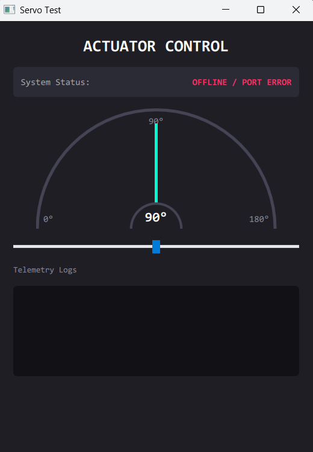

# Servo Testi




Bu proje, servo motor gibi donanım birimlerinin seri port üzerinden anlık kontrolünü ve telemetri takibini sağlayan bir masaüstü arayüzüdür. OOP (Nesne Yönelimli Programlama) mimarisiyle geliştirilmiştir.

## ✨ Öne Çıkan Özellikler

* **Canlı Görselleştirme:** Trigonometrik hesaplamalarla gerçek zamanlı çalışan görsel gösterge (gauge) ve ibre sistemi.
* **Telemetri Loglama:** Gönderilen komutların (TX) ve donanımdan gelen yanıtların (RX) anlık, zaman damgalı takibi.
* **Hata Toleransı:** Bağlantı noktası kopmaları veya donanım arızalarında sistemin çökmesini engelleyen güvenli haberleşme altyapısı.

## 🛠️ Kullanılan Teknolojiler

* **Arayüz ve Backend:** Python 3.x, PySide6 (QtQuick / QML)
* **Haberleşme:** PySerial (RS232/USB Seri Haberleşme)
* **Donanım:** Arduino (C++), SG90/MG995 Servo Motor

## ⚙️ Kurulum ve Donanım Hazırlığı

> ⚠️ **Önemli Pin Uyarısı:** Arduino kodunda servo sinyal pini olarak **Pin 9** tanımlanmıştır. Donanım bağlantısını yaparken servonun sinyal kablosunu 9. pine bağladığınızdan emin olun.

### 1. Donanım Bağlantısı
* Servo Sinyal Pini ➜ Arduino Pin 9
* Servo VCC ve GND ➜ Harici güç kaynağına veya Arduino'ya bağlayın.
* Depoda bulunan `arduino_code.ino` dosyasını kartınıza yükleyin.

### 2. Yazılım Ortamı
Gerekli Python kütüphanelerini kurun:

```bash
pip install pyserial PySide6
